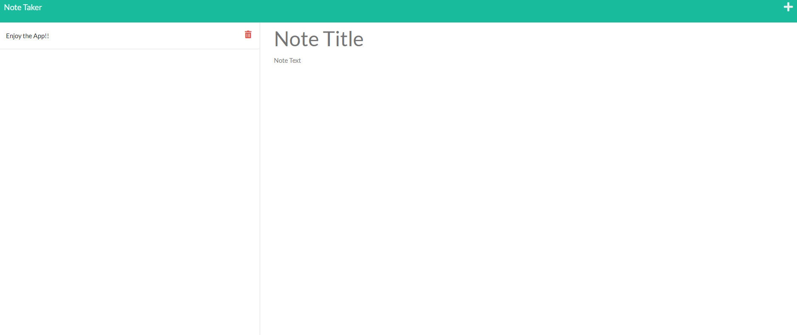

# Note Taker

  ## Description
  The purpose of this application is to write and save notes. This application uses an Express.js back end and saves and retrieves note data from a JSON file.
  
  ## Table of Contents
  - [Installation](#installation)
  - [Usage](#usage)
  - [Technologies](#technologies)
  - [Preview](#preview)
  - [Launch](#launch)
  - [License](#license)
  - [Badges](#badges)

  ## Usage
  Great for those who want to be able to write notes so that they can organize their thoughts and keeps track of tasks they need to complete. 
  ## Technologies
  - HTML
  - CSS
  - JavaScript
  - Node.js
  - Express.js
  ## Preview
  
  ## Launch
  [Heroku](https://note-taker-applicat.herokuapp.com/) 
  ## License
  MIT License

    Copyright (c) [year] [fullname]
    
    Permission is hereby granted, free of charge, to any person obtaining a copy
    of this software and associated documentation files (the "Software"), to deal
    in the Software without restriction, including without limitation the rights
    to use, copy, modify, merge, publish, distribute, sublicense, and/or sell
    copies of the Software, and to permit persons to whom the Software is
    furnished to do so, subject to the following conditions:
    
    The above copyright notice and this permission notice shall be included in all
    copies or substantial portions of the Software.
    
    THE SOFTWARE IS PROVIDED "AS IS", WITHOUT WARRANTY OF ANY KIND, EXPRESS OR
    IMPLIED, INCLUDING BUT NOT LIMITED TO THE WARRANTIES OF MERCHANTABILITY,
    FITNESS FOR A PARTICULAR PURPOSE AND NONINFRINGEMENT. IN NO EVENT SHALL THE
    AUTHORS OR COPYRIGHT HOLDERS BE LIABLE FOR ANY CLAIM, DAMAGES OR OTHER
    LIABILITY, WHETHER IN AN ACTION OF CONTRACT, TORT OR OTHERWISE, ARISING FROM,
    OUT OF OR IN CONNECTION WITH THE SOFTWARE OR THE USE OR OTHER DEALINGS IN THE
    SOFTWARE.
  ## Badges
  
  ## License Link
  [Click Me](https://opensource.org/licenses/MIT) 
